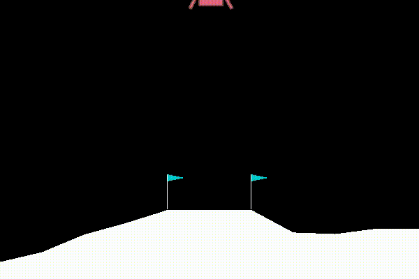
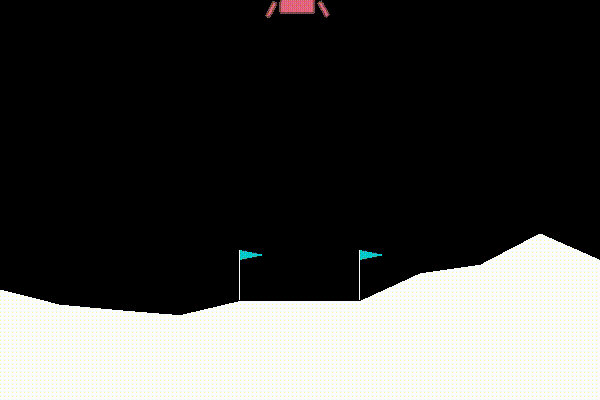

# Udacity Deep Reinforcement Learning Nanodegree 

In the deep reinforcement learning nanodegree, I solved four games in both Open AI Gym and Unity environments provided by Udacity. Multiple algorithms including DQN, DDPG, PPO, and MADDPG were tested and can be found in the project folders. (./projects/) 

## Projects Highlights
Algorithm/Task|Random Play |  Trained Agent Play
:---------------:|:---------------:|:--------------:
DQN with prioritized Replay Buffer Task: Land safely on spot||
DQN Task: Collect yellow banana ||
MADDPG Task: Play Tennis ||
DDPG Task: Joint follow the moving ball||