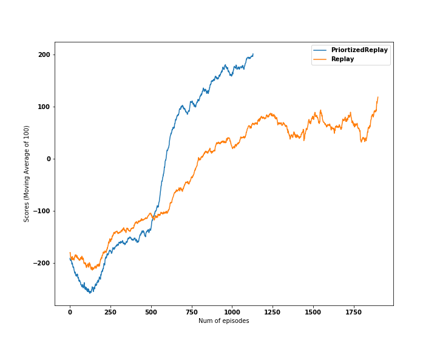
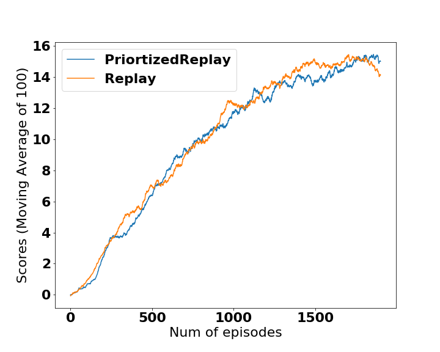

[//]: # (Image References)

[image1]: https://user-images.githubusercontent.com/10624937/42135619-d90f2f28-7d12-11e8-8823-82b970a54d7e.gif "Trained Agent"

# Project 1: Navigation

# Step 0: Installation 

## This project was carried out on local workstation with Ubuntu 16.04
Intel(R) Core(TM) i7-5820K CPU @ 3.30GHz


2 GTX 1070


## Python Environment through anaconda 

conda update conda


conda create -n rlearning python=3.6 anaconda


source activate rlearning

## Install Unity and ml-agents

The package provided in the ../python keep giving errors, I followed this [blog](https://alexisrozhkov.github.io/unity_rl/) for installing Unity and ml-agents. 


Installed ml-agents from the github [source code](https://github.com/Unity-Technologies/ml-agents), reverted back to 0.4.0. 


## Pytorch-gpu installation through anaconda

conda install pytorch torchvision cudatoolkit=9.0 -c pytorch

## Setup Note
In order to run LunarLander-v2
```
pip install gym==0.10.8
conda install swig 
pip install box2d-py
```
# Step1: Environment Introduction

For this project, you will train an agent to navigate (and collect bananas!) in a large, square world.  

![Trained Agent][image1]

A reward of +1 is provided for collecting a yellow banana, and a reward of -1 is provided for collecting a blue banana.  Thus, the goal of your agent is to collect as many yellow bananas as possible while avoiding blue bananas.  

The state space has 37 dimensions and contains the agent's velocity, along with ray-based perception of objects around agent's forward direction.  Given this information, the agent has to learn how to best select actions.  Four discrete actions are available, corresponding to:
- **`0`** - move forward.
- **`1`** - move backward.
- **`2`** - turn left.
- **`3`** - turn right.

The task is episodic, and in order to solve the environment, your agent must get an average score of +13 over 100 consecutive episodes.


# Step 2: QDN solution

## 2.1 Learning Algorithms and technical highlights
- DQN Agent: 
    - States are normalized array: For Banana Unity, it is a array of 37 dimension, and each element is normalized to [0, 1]
    - Update every: 10 steps
    - learning rate: 5e-4
    - soft update gamma: 0.99
    - batch size: 64
    - eps_start, end, decay: 1, 0.01, 0.998
    - max_t: 1000
    - loss: mse/huber
    - Replay buffer size: 10000
- Unit Tests was implemented
- Two environments were tested: LunarLander-v2 for fast test, and Bana_unity for final submission
- A wrapper was implemented for UnityEnv in order to be compatible with the syntax to gym. dqn/dqn_agent.py: UnityEnv_simple
- A prioritized replay buffer was implemented to speed up the training. The code was adaped from the [tensorflow code example](https://github.com/MorvanZhou/Reinforcement-learning-with-tensorflow/blob/master/contents/5.2_Prioritized_Replay_DQN/RL_brain.py) 
- A three layer fully connected Linear model was enough to solve this problem
    - Input size: state size
    - hidden layer size: 20, 10
    - hidden layer activation: relu
    - Outout size: actions size
    - Output activation: no
- The experiments can be run on command line with different parameters supported. 
    ```
    python agent_experiment.py  -h 
    ```
## 2.2 Folders 
- Banana_Linux/   Banana environment for linux
- dqn/ source code for DQN agent, replay buffers and nn models
- models/ scores log and solved nn models
- notebook/ analysis notebooks for environment and results 


## 2.3 Unit Test: Please pass all unit tests before running any experiment with existing code
```
python -m unittest discover unit_tests -v
```

## 2.4 To experiment with different parameters and environment (Defaut is LunarLander-v2)
```
python agent_experiment.py --device gpu ## Ordinary replaybuffer
python agent_experiment.py --device gpu --per per ## Prioritized Replay Buffer

python agent_experiment.py --device gpu --env Banana_unity --max_t 1000 --batch_size 64 --num_episodes 200 --score_threshold 13 --score_window_size 5 --update_every 10 --eps_decay 0.99
```

## 2.5 Results: 
LunarLander-V2            |  Banana Unity    
:---------------:|:--------------:
|

Note in the banana unity environment, when the agent reached the threshold performance of score 13, the eps is still ~0.3. This may contributes to the similar performance of prioritized experience replay (PER) and regular replay buffer. 

# Future improvements
- Optimize the training efficiency, e.g. parallelize the agent experience collection, improve the efficiency of current sumtree (for PER) implementaion. 
- Improve the hyperparameters after efficiency is improved
- Implement Dueling DQN
