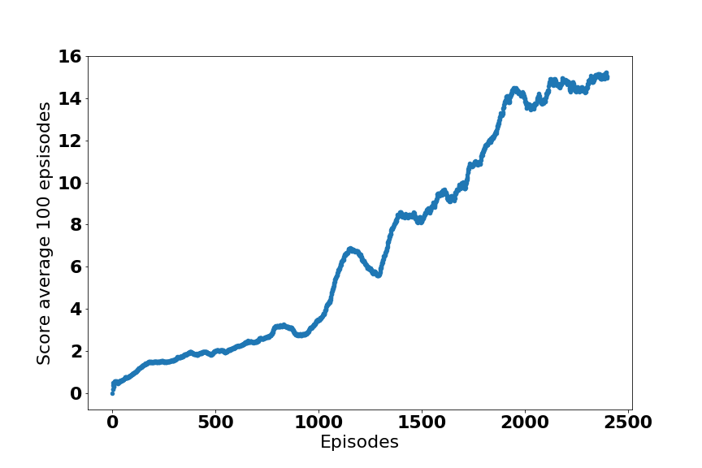

#DDPG solution
## Learning Algorithms and technical highlights
- DDPG Agent (agents/ddpg_agent.py): 
    - States normalization: Two ways are used to normalize states, one is to manually normalize the states with a wraper (agents/Unity_Env.py), another way is to add a batch normalization layer in both actor and critic models
    - learning rate: actor 1e-4 and critic 5e-4
    - soft update gamma: 0.99
    - batch size: 1028
    - max_t: 1000
    - loss: mse
    - Replay buffer size: 1e6
- Unit Tests was implemented (unit_tests/)
- Two environments are supported: Reacher_v1 and Reacher_v2 
- A wrapper was implemented for UnityEnv in order to be compatible with the syntax to gym. agents/dqn_agent.py
- A [prioritized experience replay](https://arxiv.org/abs/1511.05952) buffer was implemented to speed up the training. The code was adaped from the [tensorflow code example](https://github.com/MorvanZhou/Reinforcement-learning-with-tensorflow/blob/master/contents/5.2_Prioritized_Replay_DQN/RL_brain.py) 
- The actor/critic network structure was found the key tests for solving the reacher environments
- Actor network has one layer with hidden units 128
- Critic network has three layers: one hidden layer of 64 before concatenating with action vector; Another two hidden layers of 128 and 64 was added before output values. 
- The experiments can be run on command line with different parameters 
    ```
    python ddpg_experiment.py  -h 
    ```
## Results: 
Reacher V1 Score vs Num of episodes   

<


The actor critical weights are as follows, 

actor: models/actor_iter2400_Reacher_unity_v1_episodes_2400_score_15.0070996645651762019_06_11_15_18_17__checkpoint.pth


Critic: models/critic_iter2400_Reacher_unity_v1_episodes_2400_score_15.0070996645651762019_06_11_15_18_17__checkpoint.pth

Note in the reacher unity environment, the agent achieved average score > 13 for continous 100 games after 1800 episodes. The actor/critic network architectures turn out to be the key tests to solve the reacher environment. 


# Future improvements
- Test PPO agent use the same actor critic network to solve the reacher v2. 

