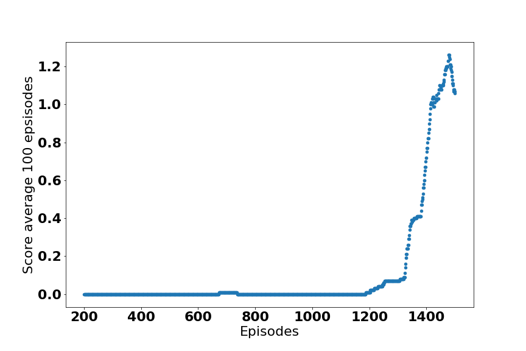

# DDPG solution for stationary multi-agent environment

The tennis environment provides two agents and each agent is able to play independently without considering cooperation with the other agent. Therefore the other agent could be taken as part of the environment state.  

## Learning Algorithms and technical highlights

- DDPG Agent (agents/ddpg_agent.py): 
    - learning rate: actor 1e-4 and critic 3e-4
    - soft update gamma: 0.99
    - batch size: 1028
    - max_t: 1000
    - loss: mse
    - Replay buffer size: 1e6
- Unit Tests was implemented (unit_tests/)

- A wrapper was implemented for UnityEnv in order to be compatible with the syntax to gym. 
- A [prioritized experience replay](https://arxiv.org/abs/1511.05952) buffer was implemented to speed up the training. The code was adaped from the [tensorflow code example](https://github.com/MorvanZhou/Reinforcement-learning-with-tensorflow/blob/master/contents/5.2_Prioritized_Replay_DQN/RL_brain.py) 
- Train a single agent that works on both sides was found to be effective
- The actor/critic network structure was found the key tests
- Actor network has two hidden layers with units 128 and 64
- Critic network has three layers: one hidden layer of 64 before concatenating with action vector; Another two hidden layers of 128 and 64 was added before output values. 
- The experiments can be run on command line with different parameters 
    ```
    python ddpg_experiment.py  -h 
    ```
## Results: 
Reacher V1 Score vs Num of episodes   

<


The actor critic weights are as follows, 

actor: models/actor_iter1500_Tennis_episodes_1500_score_1.06980001608841112019_07_06_17_33_23__checkpoint.pth


Critic: models/critic_iter1500_Tennis_episodes_1500_score_1.06980001608841112019_07_06_17_33_23__checkpoint.pth

Note the agent achieved average score > 1 for continous 100 games after 1500 episodes. 

Current unity environment doesn't provide a easy way to save images, we used kazam to save the screencast and created gif as shown below. Please refer [this notebook](notebook/Visualize_agent_play.ipynb) for usage. 
```
ffmpeg -i video.avi -t 10 out%d.gif
```
Tennis  Random Play |  Tennis  Agent Play
:---------------:|:--------------:
|


# Future improvements
- Try to solve other multi-agent environment such as soccer with more advanced MARL algorithms. 

