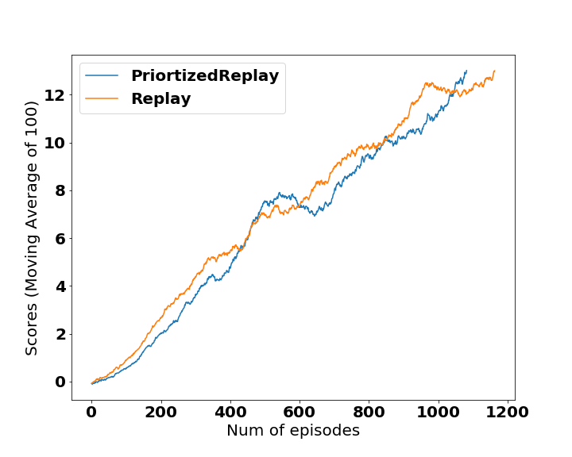

#QDN solution
## Learning Algorithms and technical highlights
- DQN Agent (dqn/dqn_agent.py): 
    - States are normalized: For Banana Unity, it is a array of 37 dimension, and each element is normalized to [0, 1]
    - Update every: 10 steps
    - learning rate: 5e-4
    - soft update gamma: 0.99
    - batch size: 64
    - eps_start, end, decay: 1, 0.01, 0.998
    - max_t: 1000
    - loss: mse/huber
    - Replay buffer size: 10000
- Unit Tests was implemented (unit_tests/)
- Two environments are supported: LunarLander-v2 for debugging, and Bana_unity for final submission
- A wrapper was implemented for UnityEnv in order to be compatible with the syntax to gym. dqn/dqn_agent.py: UnityEnv_simple
- A [prioritized experience replay](https://arxiv.org/abs/1511.05952) buffer was implemented to speed up the training. The code was adaped from the [tensorflow code example](https://github.com/MorvanZhou/Reinforcement-learning-with-tensorflow/blob/master/contents/5.2_Prioritized_Replay_DQN/RL_brain.py) 
- A three layer fully connected Linear model was enough to solve this problem
    - Input size: state size
    - hidden layer size: 20, 10
    - hidden layer activation: relu
    - Outout size: actions size
    - Output activation: no
- The experiments can be run on command line with different parameters 
    ```
    python agent_experiment.py  -h 
    ```
## Results: 
|  Banana Unity Score vs Num of episodes   
:---------------:|:--------------:
<

Note in the banana unity environment, the agent achieved average score > 13 for continous 100 games. 

Current unity environment doesn't provide a easy way to save images, we used kazam to save the screencast and created gif as shown below. The submitted models for Banana Unity is models/Banana_unity_episodes_2000_score_15.022019_05_19_20_17_50_banana_per_20_checkpoint.pth. Please refer [this notebook](notebook/Visualize_agent_play.ipynb) for usage. 
```
ffmpeg -i video.avi -t 10 out%d.gif
```
Unity Banana  Random Play |  Unity Banana  Agent Play
:---------------:|:--------------:
|


# Future improvements
- Optimize the training efficiency, e.g. parallelize the agent experience collection.  The efficiency of the replay buffer is a bottle neck with the buffer_size is large, so improving the efficiency of current sumtree (for PER) implementaion could speed up the test.  
- In order to make practical use of the RL technology, the custom designed environment that simuate real life tasks will be tested with current DQN implementation. 

